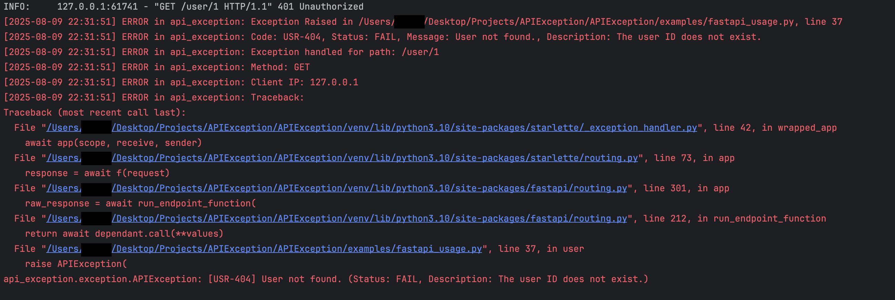
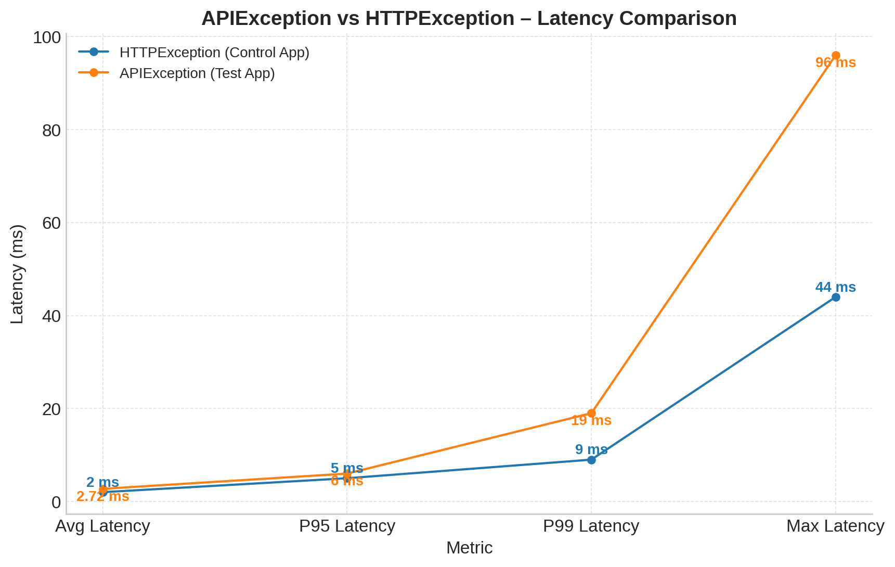

<p align="center">
  
</p>
<p align="center"><b><i>Standardising FastAPI responses with clarity, consistency, and control.</i></b></p>

# APIException: Standardised Exception Handling for FastAPI
[](https://pypi.org/project/APIException/)
[](https://akutayural.github.io/APIException/)
[](https://pepy.tech/project/APIException)
[](https://pypi.org/project/APIException/)
[](https://opensource.org/licenses/MIT)
[](https://github.com/psf/black)

**APIException** is a robust, production-ready Python library for FastAPI that simplifies exception handling and ensures consistent, well-structured API responses. Designed for developers who want to eliminate boilerplate error handling and improve Swagger/OpenAPI documentation, APIException makes your FastAPI projects cleaner and easier to maintain.

- 🔒 Consistent JSON responses for **both** success and errors.
- 📚 Beautiful Swagger/OpenAPI documentation with clear error cases.
- ⚙️ Customizable error codes with `BaseExceptionCode`.
- 🔗 Global fallback for unhandled server-side errors.
- 🗂️ Use with **multiple FastAPI apps**.
- 📜 Automatic logging of every exception detail.
- ✔️ Production-ready with unit test examples.

· [**View on PyPI**](https://pypi.org/project/APIException) 

· [**Full Documentation**](https://akutayural.github.io/APIException/)

Reading the [full documentation](https://akutayural.github.io/APIException/) is **highly recommended** — it’s clear, thorough, and helps you get started in minutes.

---

## 📦 Installation via pip

```bash
pip install apiexception
```


---

 ## ⚡ Quickstart: How to Integrate APIException

**1️⃣ Register the Handler**

```python
from api_exception import register_exception_handlers
from fastapi import FastAPI

app = FastAPI()
register_exception_handlers(app)  # uses ResponseModel by default

# Use raw dict instead:
# register_exception_handlers(app, use_response_model=False)
```

---

 ## 🔍 Example: Error Handling with Custom Codes

```python
from fastapi import FastAPI, Path
from api_exception import APIException, ExceptionStatus, register_exception_handlers, ResponseModel, APIResponse, BaseExceptionCode
from pydantic import BaseModel

app = FastAPI()

# Register exception handlers globally to have the consistent
# error handling and response structure
register_exception_handlers(app=app)

# Create the validation model for your response
class UserResponse(BaseModel):
    id: int
    username: str

# Define your custom exception codes extending BaseExceptionCode
class CustomExceptionCode(BaseExceptionCode):
    USER_NOT_FOUND = ("USR-404", "User not found.", "The user ID does not exist.")

    
@app.get("/user/{user_id}",
    response_model=ResponseModel[UserResponse],
    responses=APIResponse.default()
)
async def user(user_id: int = Path()):
    if user_id == 1:
        raise APIException(
            error_code=CustomExceptionCode.USER_NOT_FOUND,
            http_status_code=401,
        )
    if user_id == 3:
        a=1
        b=0
        c = a / b  # This will raise a ZeroDivisionError
        return c
    data = UserResponse(id=1, username="John Doe")
    return ResponseModel[UserResponse](
        data=data,
        description="User found and returned."
    )
```


---


In both `error` and the `success` cases, the response structure is **consistent**.

- In the example above, when the `user_id` is `1`, it raises an `APIException` with a custom `error_code`, the response is formatted according to the `ResponseModel` and it's logged **automatically** as shown below:




#### - Uncaught Exception API Response?

What if you forget to handle an exception such as in the **example** above?

- When the `user_id` is `3`, the program automatically catches the `ZeroDivisionError` and returns a standard error response, logging it in a **clean structure** as shown below:

```json
{
  "data": null,
  "status": "FAIL",
  "message": "Something went wrong.",
  "error_code": "ISE-500",
  "description": "An unexpected error occurred. Please try again later."
}
```


**2️⃣ Raise an Exception**

```python
from api_exception import APIException, ExceptionCode, register_exception_handlers
from fastapi import FastAPI
app = FastAPI()

register_exception_handlers(app)

@app.get("/login")
async def login(username: str, password: str):
    if username != "admin" or password != "admin":
        raise APIException(
            error_code=ExceptionCode.AUTH_LOGIN_FAILED,
            http_status_code=401
        )
    return {"message": "Login successful!"}
```

---

**3️⃣ Use ResponseModel for Success Responses**

```python
from api_exception import ResponseModel, register_exception_handlers
from fastapi import FastAPI
app = FastAPI()

register_exception_handlers(app)

@app.get("/success")
async def success():
    return ResponseModel(
        data={"foo": "bar"},
        message="Everything went fine!"
    )
```

**_Response Model In Abstract:_**


---

## 🧩 Custom Error Codes

Always extend BaseExceptionCode — don’t subclass ExceptionCode directly!

```python
from api_exception import BaseExceptionCode

class CustomExceptionCode(BaseExceptionCode):
    USER_NOT_FOUND = ("USR-404", "User not found.", "User does not exist.")
    INVALID_API_KEY = ("API-401", "Invalid API key.", "Key missing or invalid.")
```

And use it:

```python
from api_exception import APIException

raise APIException(
    error_code=CustomExceptionCode.USER_NOT_FOUND,
    http_status_code=404
)
```

---

## ⚙️ Override Default HTTP Status Codes

```python
from api_exception import set_default_http_codes

set_default_http_codes({
    "FAIL": 422,
    "WARNING": 202
})
```

---

## 🌐 Multiple Apps Support
```python
from fastapi import FastAPI
from api_exception import register_exception_handlers

mobile_app = FastAPI()
admin_app = FastAPI()
merchant_app = FastAPI()

register_exception_handlers(mobile_app)
register_exception_handlers(admin_app)
register_exception_handlers(merchant_app)
```

---

## 📝 Automatic Logging

Every APIException automatically logs:

- File name & line number

- Error code, status, message, description

Or use the built-in logger:

```python
from api_exception import logger

logger.info("Custom info log")
logger.error("Custom error log")
```

---

## ✅ Testing Example

```python
import unittest
from api_exception import APIException, ExceptionCode, ResponseModel

class TestAPIException(unittest.TestCase):
    def test_api_exception(self):
        exc = APIException(error_code=ExceptionCode.AUTH_LOGIN_FAILED)
        self.assertEqual(exc.status.value, "FAIL")

    def test_response_model(self):
        res = ResponseModel(data={"foo": "bar"})
        self.assertEqual(res.status.value, "SUCCESS")

if __name__ == "__main__":
    unittest.main()
```

**Run the Tests**
- To run the tests, you can use the following command in your terminal:

```bash
python -m unittest discover -s tests
```

---

## 🔗 Full Documentation

Find detailed guides and examples in the [official docs](https://akutayural.github.io/APIException/).

---
## 📊 Benchmark

We benchmarked **apiexception's** `APIException` against **FastAPI's** built-in `HTTPException` using **Locust** with **200** concurrent users over **2 minutes**.
This can be used as a foundation. Can be extended to include more detailed tests. 

| Metric                    | HTTPException (Control App) | APIException (Test App) |
|---------------------------|-----------------------------|-------------------------|
| Avg Latency               | **2.00 ms**                 | 2.72 ms                 |
| P95 Latency               | 5 ms                        | 6 ms                    |
| P99 Latency               | **9 ms**                    | 19 ms                   |
| Max Latency               | **44 ms**                   | 96 ms                   |
| Requests per Second (RPS) | ~608.88                     | ~608.69                 |
| Failure Rate (`/error`)   | 100% (intentional)          | 100% (intentional)      |

**Analysis**  
- Both implementations achieved almost identical throughput (~609 RPS).  
- In this test, APIException’s **average latency was only +0.72 ms** higher than HTTPException (2.42 ms vs 2.00 ms).  
- **The P95 latencies** were nearly identical at 5 ms and 6 ms, while **the P99** and **maximum latencies** for APIException were slightly higher but still well within acceptable performance thresholds for APIs.
> `Important Notice:` `APIException` automatically logs exceptions, while FastAPI’s built-in `HTTPException` does not log them by default.
> Considering the extra **logging feature**, these performance results are **very strong**, showing that APIException delivers standardized error responses, cleaner exception handling, and logging capabilities **without sacrificing scalability**.


<figure style="margin: 0; text-align: center;">
  
  <figcaption style="margin-top: 4px; font-style: italic; font-size: 0.9em;">
    HTTPException vs APIException – Latency Comparison
  </figcaption>
</figure>

Benchmark scripts and raw Locust reports are available in the [benchmark](https://github.com/akutayural/APIException/tree/main/benchmark) directory.


## 📜 Changelog

**v0.1.17 (2025-08-11)**

✅ **Initial stable version**

- `RFC 7807` standard support for consistent error responses (`application/problem+json`)

- OpenAPI (Swagger) schema consistency: nullable fields are now explicitly shown for better compatibility

- `Poetry` support has been added for dependency management

- `uv` support has been added.

- extra logger message param has been added to `APIException` for more detailed logging

- `log_traceback` and `log_traceback_unhandled_exception` parameters have been added to `register_exception_handlers()` for more control over logging behavior

- `log_exception` parameter has been added to `APIException` for more control over logging behavior

- `log_message` parameter has been added to `APIException` for more control over logging behavior

- Logging now uses `add_file_handler()` to write logs to a file

- Logging improvements: now includes exception arguments in logs for better debugging

- Documentation has been updated.    

- Readme.md has been updated. 

**v0.1.16 (2025-07-22)**

✅ **Initial stable version**

- setup.py has been updated.

- Project name has been updated. Instead of `APIException` we will use `apiexception` to comply with `PEP 625`.

- Documentation has been updated. 

- Readme.md has been updated. 

**v0.1.15 (2025-07-22)**

- setup.py has been updated.

- Project name has been updated. Instead of `APIException` we will use `apiexception` to comply with `PEP 625`.

- Documentation has been updated. 

- Readme.md has been updated. 


**v0.1.14 (2025-07-22)**

- setup.py has been updated.

- Project name has been updated. Instead of `APIException` we will use `apiexception` to comply with PEP 625.

**v0.1.13 (2025-07-21)**

- /examples/fastapi_usage.py has been updated.

- 422 Pydantic error has been fixed in APIResponse.default()

- Documentation has been updated.

- Exception Args has been added to the logs.

- Readme has been updated. New gifs have been added.


**v0.1.12 (2025-07-14)**

- /examples/fastapi_usage.py has been updated.

- 422 Pydantic error has been handled in register_handler

- Documentation has been added.

- `use_fallback_middleware` has been added.

**v0.1.11 (2025-07-13)**

- Added CLI entrypoint (api_exception-info)

- Stable test suite with FastAPI TestClient

- Multiple app support

- Raw dict or Pydantic output

- Automatic logging improvements


**v0.1.0 (2025-06-25)**


🚀 Prototype started!

- Project scaffolding

- `ResponseModel` has been added

- `APIException` has been added

- Defined base ideas for standardizing error handling

---

## License
This project is licensed under the MIT License. See the [LICENSE](./LICENSE) file for more details.
If you like this library and find it useful, don’t forget to give it a ⭐ on GitHub!

## Contact
If you have any questions or suggestions, please feel free to reach out at [ahmetkutayural.dev](https://ahmetkutayural.dev/#contact)
Don't forget to add your email to the contact form! 

---

## 📖 Learn More

📚 **Full APIException Documentation**  
https://akutayural.github.io/APIException/

🐍 **PyPI**  
https://pypi.org/project/apiexception/

💻 **Author Website**  
https://ahmetkutayural.dev
