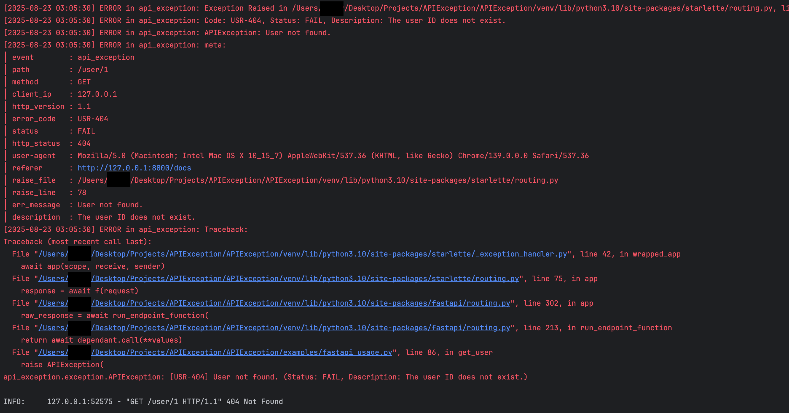
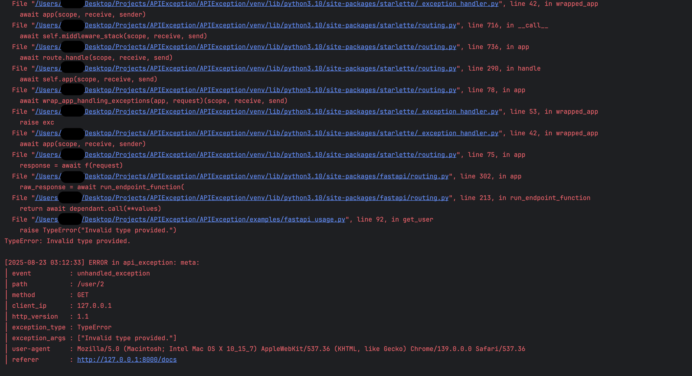

# 🪵 Logging & Debug

Good exception handling is only half the battle — **logging** is what keeps your team sane in production.

With APIException, unexpected errors don’t just return a nice JSON response;

they’re also **automatically logged** so you always have a clear trail of what went wrong — and when needed, you can also **log manually** using the built-in logger for custom events or diagnostics.

---

## ✅ How It Works

**Auto-logging:**
```python
from api_exception import register_exception_handlers
from fastapi import FastAPI

app = FastAPI()
register_exception_handlers(
    app=app,
    use_fallback_middleware=True
)
```
You get two powerful behaviors:

1️⃣ **All handled APIExceptions** are logged with:
- HTTP status
- Exception code
- Message
- Context & traceback

2️⃣ **Unhandled exceptions** (like DB errors, 3rd-party failures) are caught by the fallback middleware and:
- Return a consistent JSON error response (ISE-500 by default)
- The full traceback to your console or logging system


**Manual-Logging:**


If you want to log your own events (not just exceptions), you can use the built-in logger:

```python
from api_exception.logger import logger
logger.warning("This will be logged to both console and file")
logger.info("This INFO log will also be written to the file"
```
Also you can call add_file_handler to write log to file
```python
from api_exception.logger import add_file_handler,logger
add_file_handler("api_exception.log", level=logging.DEBUG)
logger.warning("This will be logged to both console and file")
```
---

## ⚙️ Example Output

When an exception happened, you’ll see logs like:



When something unexpected happens, you’ll see logs like:



---

## ⚡ Tips

✅ Use FastAPI’s native logging module to pipe logs to your file, console, or external log aggregator (ELK, CloudWatch, etc.).

✅ Combine this with FastAPI middlewares or your own log formatter if you want structured JSON logs.

✅ For sensitive environments, make sure your logs do not expose user data.

---

## 📚 Next

✔️ Want to see how fallback works?  
Check out [🪓 Fallback Middleware](../usage/fallback.md)

✔️ Need better Swagger docs?  
Go to [📚 Swagger Integration](swagger.md)

✔️ Haven’t defined custom codes yet?  
Read [🗂️ Custom Exception Codes](../usage/custom_codes.md)

