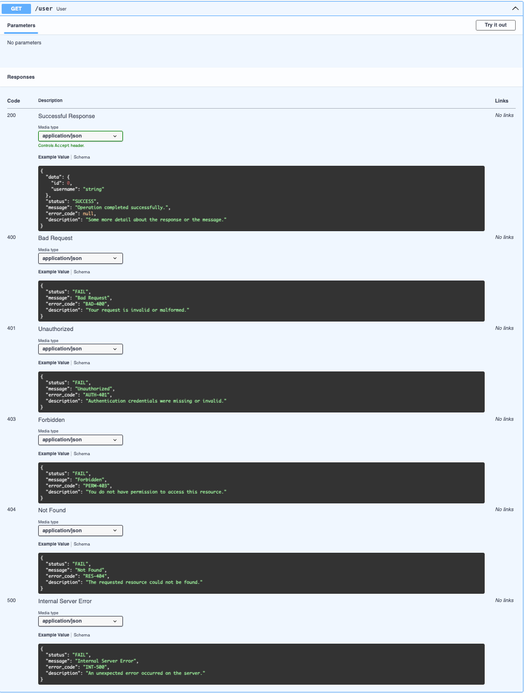
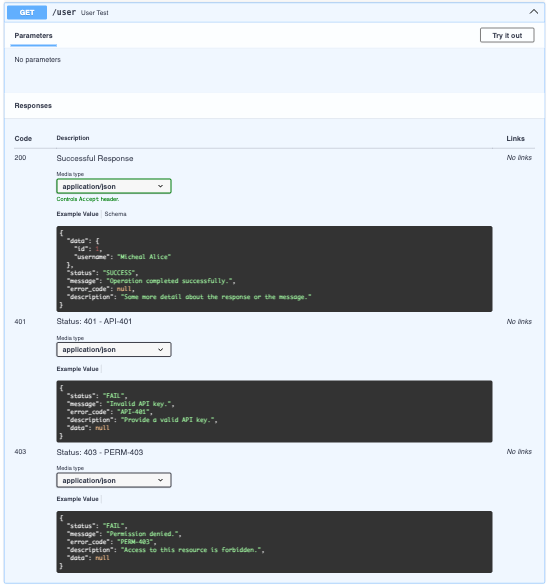
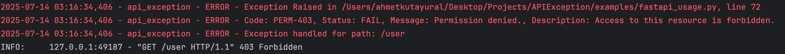

# 📚 Swagger Integration

One of the best parts of **APIException** is how cleanly it integrates with `Swagger (OpenAPI)`.

Your success and error responses get documented with clear, predictable schemas — so your consumers, frontend teams, and testers know exactly what to expect.

> 💡 Unlike many solutions that omit `null` fields from example responses, **APIException** explicitly includes them.  
> This ensures the **full shape of the response model** is preserved in the documentation, even when some values are `null`.

--- 
## ✅ How it works

Use the `response_model` parameter for your success schema,
and `APIResponse.default()` for default error code values,
`APIResponse.custom(*items)` for custom error codes and
`APIResponse.rfc7807(*items)` for RFC7807 Standart response with customer error codes to document **expected error cases**.

---

## ⚙️ Example: `APIResponse.default()`

This documents your success response plus the default errors (400, 401, 403, 404, 422, 500).

```python
from APIException import APIResponse, ResponseModel
@app.get("/user",
    response_model=ResponseModel[UserResponse],
    responses=APIResponse.default()
)
```

When you open **Swagger UI**, it will show all the possible success and error cases:



---

## ⚙️ Example: `APIResponse.custom()`

Want more control?

Use `APIResponse.custom()` to add your own specific error codes for each endpoint.

```python
from APIException import ResponseModel, APIResponse
@app.get("/user",
    response_model=ResponseModel[UserResponse],
    responses=APIResponse.custom(
        (401, CustomExceptionCode.INVALID_API_KEY),
        (403, CustomExceptionCode.PERMISSION_DENIED)
    )
)
```
In **Swagger UI**, your custom error cases will show up clearly alongside your success model:



## ⚙️ Example: `APIResponse.rfc7807()`

The exception messages will be formatted as RFC 7807.

```python
from schemas.response_model import ResponseModel
from api_exception import APIResponse

@app.get(
    "/rfc7807",
    response_model=ResponseModel[UserResponse],
    responses=APIResponse.rfc7807(
        (401, CustomExceptionCode.INVALID_API_KEY, "https://example.com/errors/unauthorized", "/account/info"),
        (403, CustomExceptionCode.PERMISSION_DENIED, "https://example.com/errors/forbidden", "/admin/panel"),
        (422, CustomExceptionCode.VALIDATION_ERROR, "https://example.com/errors/unprocessable-entity", "/users/create")
    ),
)
```


Want to go deeper? Read the [RFC 7807 Standard](rfc7807.md)

---

## ⚡ Tips

✅ APIResponse.default() is perfect for general endpoints that follow standard error codes.

✅ APIResponse.custom(*items) gives you precise control for business-specific exceptions.
✅ Use APIResponse.rfc7807(*items) to handle business-specific exceptions with full control, fully compliant with the RFC 7807 standard.

No more incomplete or confusing Swagger docs!

---

## 📚 Next

✔️ Learn how to log exceptions properly:  
Check [🪵 Logging & Debug](logging.md)

✔️ Not using ResponseModel yet?  
See [✅ Response Model](../usage/response_model.md)

✔️ Want to add fallback error handling?  
See [🪓 Fallback Middleware](../usage/fallback.md)

✔️ Want to align your API with the RFC7807 standard?  
See [🪓 RFC7807 Support](rfc7807.md)