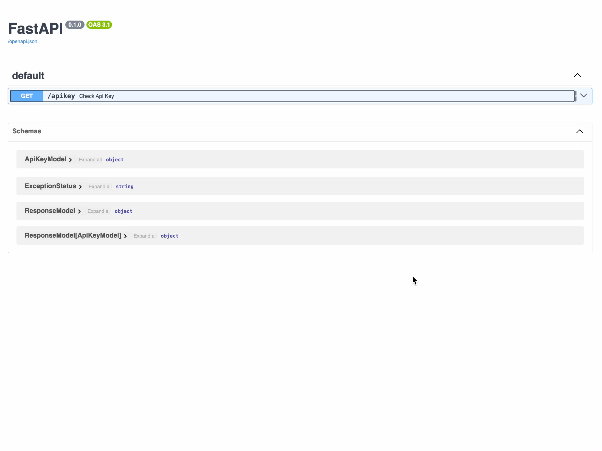

# 🧩 Using `ResponseModel`

A **clean, predictable response structure** is the heart of a stable API.

The `ResponseModel` in **APIException** makes sure every success **and** error response always has the same JSON format — easy to document, easy to parse, and friendly for frontend teams.


---

## ✅ How It Works

Every API response includes:

- `data`: your actual payload  
- `status`: one of `SUCCESS`, `WARNING`, `FAIL`  
- `message`: a short summary of the outcome  
- `error_code`: only filled if there’s an error  
- `description`: extra context for debugging

👉 **How to interpret:**

- If `data` is populated and `error_code` is null → treat as **success**

- If `error_code` is filled → treat as **fail**

- Your frontend can **always** rely on the `status` field to drive logic


## 📌 Example

### ✅ Import and Use

```python
from fastapi import FastAPI
from pydantic import BaseModel, Field
from apiexception import (
    ResponseModel,
    APIResponse,
    APIException,
    ExceptionStatus,
    BaseExceptionCode
)

app = FastAPI()
register_exception_handlers(app=app)


'''
Custom Exception Class that you can define in your code to make the backend responses look more standardized.
Just extend the `BaseExceptionCode` and use it. 
'''
class CustomExceptionCode(BaseExceptionCode):
    INVALID_API_KEY = ("API-401", "Invalid API key.", "Provide a valid API key.")


class ApiKeyModel(BaseModel):
    api_key: str = Field(..., example="b2013852-1798-45fc-9bff-4b6916290f5b", description="Api Key.")


@app.get(
    "/apikey",
    response_model=ResponseModel[ApiKeyModel],
    responses=APIResponse.default()
)
async def check_api_key(api_key: str):
    if api_key != "valid_key":
        raise APIException(
            error_code=CustomExceptionCode.INVALID_API_KEY,
            http_status_code=401,
        )
    data = ApiKeyModel(api_key="valid_key")
    return ResponseModel(
        data=data,
        status=ExceptionStatus.SUCCESS,
        message="API key is valid",
        description="The provided API key is valid."
    )

```
### ✅ Successful Response

```json
{
  "data": {
    "api_key": "valid_key"
  },
  "status": "SUCCESS",
  "message": "API key is valid",
  "error_code": null,
  "description": "The provided API key is valid."
}
```




### ❌ Error Response

```json
{
  "data": null,
  "status": "FAIL",
  "message": "Invalid API key.",
  "error_code": "API-401",
  "description": "Provide a valid API key."
}
```


---

No matter what happens — **same shape, same fields, always predictable.**

## ⚡ Why Use It?

✔️ Frontend teams can build once and trust the schema.

✔️ No more scattered response shapes across endpoints.

✔️ Swagger/OpenAPI docs stay clear and self-explanatory.

✔️ Debugging becomes easy with `description` and `error_code`.

---
## 📚 Next

✔️ Ready to define your own error codes?  
Check out [🗂️ Custom Exception Codes](custom_codes.md)

✔️ Want to handle unexpected crashes globally?  
Learn about [🪓 Fallback Middleware](fallback.md)

✔️ Want to see how this shows up in Swagger?  
Head over to [📚 Swagger Integration](../advanced/swagger.md)
